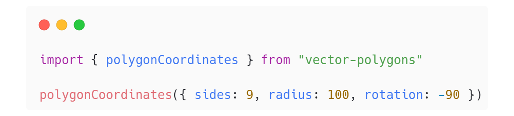

  

<h1 align="center">Vector Polygons</h1>

<h1></h1>

 Easily generate coordinates for regular polygons
      

Just a little function that takes some parameters, and spits out vertex coordinates for any regular 2d polygons with `n` number of sides. It was a tangent on something else I was working on, and a fun little exercise in TypeScript. I'm also using this minor project to work on documentation and testing tools, so this will likely be overkill.

Feel free to submit an issue or pull request if you want to see anything changed.

- [Usage](#usage)
- [Development](#development)
- [Built with](#built-with)
- [License](#license)

## Usage

Download the library from `undecided package manager`, and import the library into your project to get started.

Click [here](https://www.desmos.com/calculator/ascq20nscb) to view the resulting nonagon on Desmos!

## Development

Want to contribute? Great!

To fix a bug or enhance the project, please follow these steps:

- Fork the repo
- Create a new branch (`git checkout -b branch-name`)
- Make the appropriate changes in the files
- Add changes to reflect the changes made
- Commit your changes (`git commit -am 'Stuff Fixed'`)
- Push to the branch (`git push origin branch-name`)
- Create a Pull Request

## Built with

- [Typescript](https://github.com/microsoft/TypeScript)

## License

MIT License - found [here](./license.md).